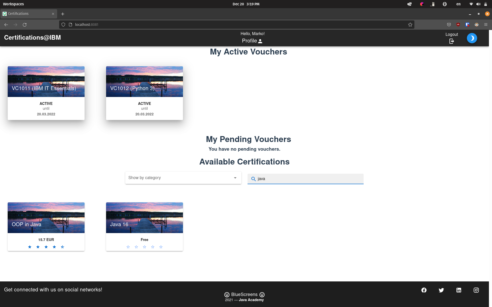
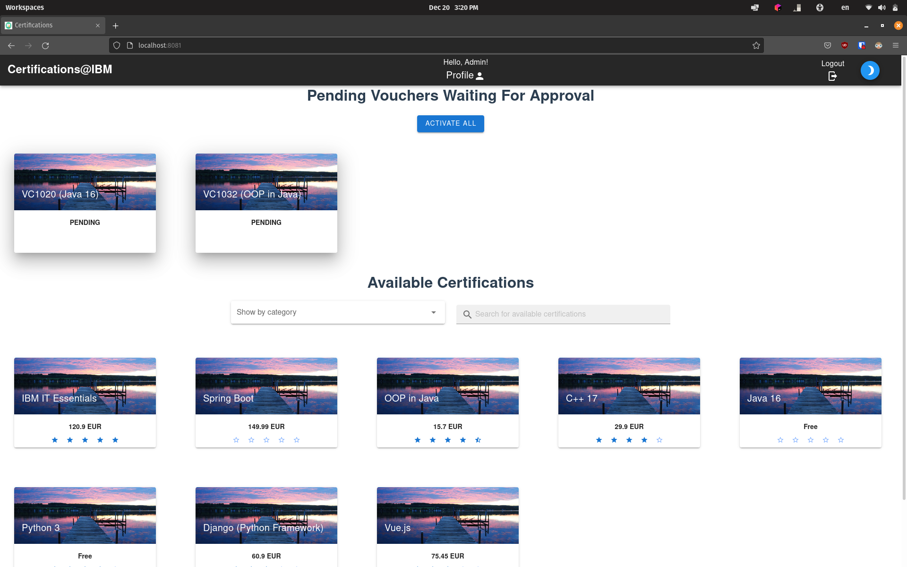
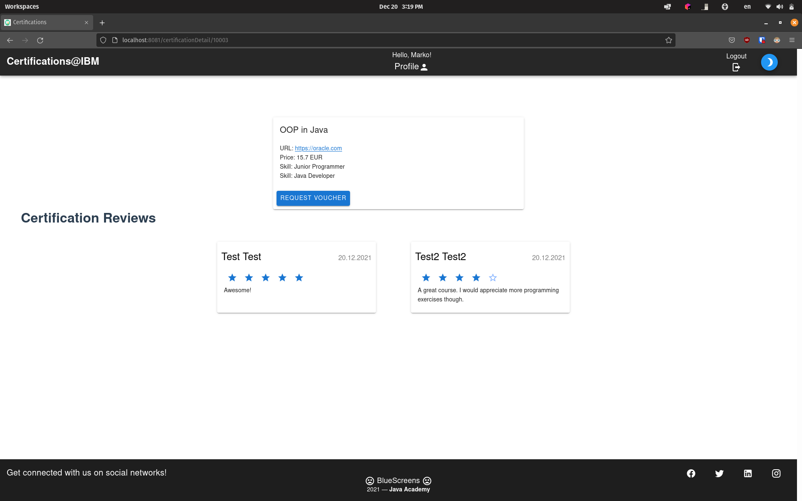
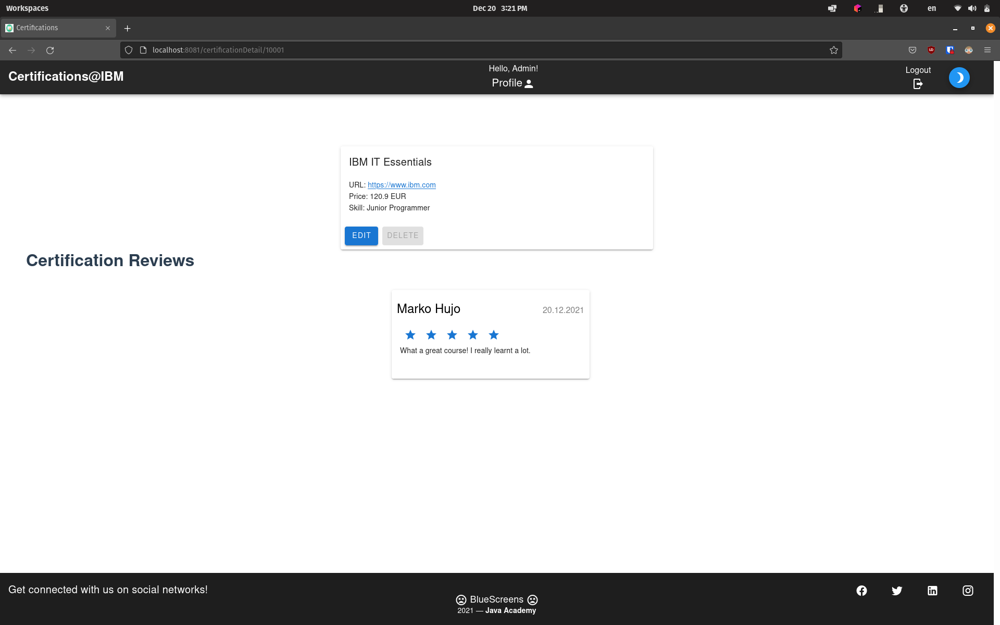
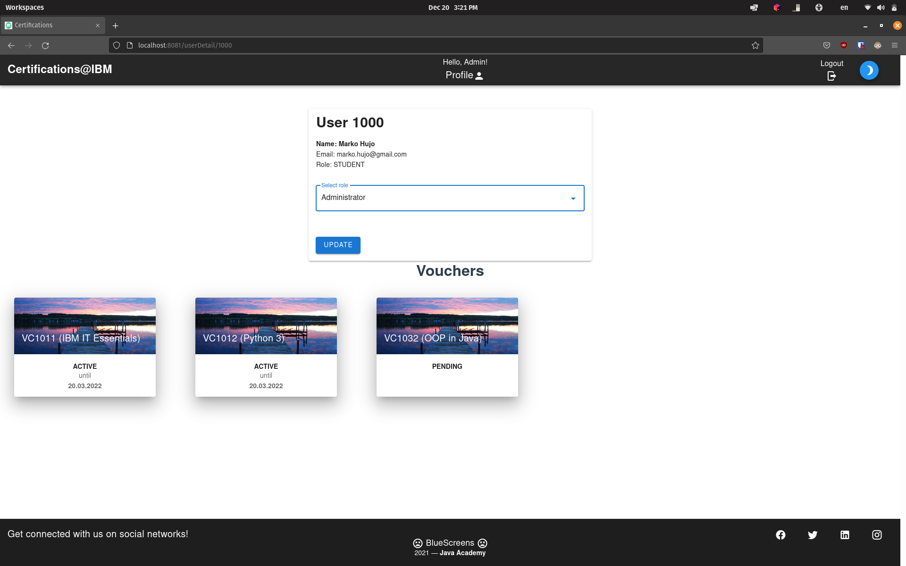

# IBM Certifications App

Web app that lets students enroll in various courses and earn certifications. Built with Spring Boot and Vue.js in a team of 4 during IBM Virtual Java Academy 2021. We were awarded the best team of the academy for building this app.

### Main features:
- Supports three user roles: **student**, **manager** and **administrator**
- Students can request certification vouchers
- Students can review courses that they are enrolled in
- Managers and admins can accept student's requests and make their vouchers active
- Managers and admins can create, edit and delete courses
- Admins can see all users and change their roles

### Student's home view:

### Admin's home view:

### Student's course view:

### Admin's course view:

### Admin's profile view:

